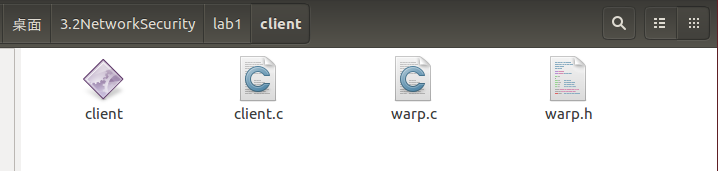

# 网络安全实验报告 - 基于socket的扫描器设计

* 课程名称：网络安全
* 实验题目：基于socket的扫描器设计
* 学号：1162100526
* 姓名：蔡晨馨


### 1. 实验目的

* 熟悉Linux编程环境。
* 学习在Linux环境下编写C/S程序，熟悉socket编程，能够完成传输文件的任务。
* 学习基于socket的扫描器程序编写。
* 学习UI界面的编写。

### 2. 实验要求及实验环境

* 实验要求：

1. 熟悉Linux编程环境

2. 在Linux环境下编写C/S程序，熟悉socket编程。要求客户端和服务端能够传送指定文件。该程序在后续实验中仍需使用。客户端与服务端在不同机器中。

3. 在Windows环境下利用socket的connect函数进行扫描器的设计，要求有界面，界面能够输入扫描的ip范围和端口范围，和需使用的线程数，显示结果。

* 实验环境：

1. C/S程序：Ubuntu 16.04 LTS | C

2. 扫描器设计：macOS High Sierra 10.13.3 | C++ | Qt

   IDE: Qt Creator

### 3. 实验内容

##### 1. 编写Client/Server程序，实现二者之间的文件传输。

* C语言为socket编程提供了相关的函数。

  ```C
  /*创建一个socket描述符 类似打开一个文件*/
  int socket(int domain, int type, int protocol);
  /*给socket赋特定地址 一般为server*/
  int bind(int sockfd, const struct sockaddr *addr, socklen_t addrlen);
  /*server调用listen监听socket*/
  //backlog	相应socket可排队的最大连接数,待连接数
  int listen(int sockfd, int backlog);
  /*client调用connect发出连接请求*/
  //sockaddr	server的socket地址
  int connect(int sockfd, const struct sockaddr *addr, socklen_t addrlen);
  /*server监听到请求调用accept接收请求*/
  int accept(int sockfd, struct sockaddr *addr, socklen_t *addrlen);
  /*关闭socket描述字*/
  int close(int fd);
  ```

* **Server端**的创建顺序一般为：socket - bind - listen - accept

  **Client端**的创建顺序一般为：socket - connect

* 在accept函数正常返回之后，Server端进行连接后的工作。

  本次实验中为接收文件的名称，并读取文件，将其发送给Client端。

* 在connect函数正常返回之后，Client端进行连接后的工作。

  本次实验中为发送下载文件的名称，接收Server端发送过来的文件，并将其保存。

* **关于发送和接收文件**

  本实验中使用recv与send函数，当发送终止的时候Server端调用shutdown函数，发送FIN指令，使Client端的recv函数返回0，接收终止。

  ```c
  ssize_t send(int sockfd, const void *buf, size_t len, int flags);
  ssize_t recv(int sockfd, void *buf, size_t len, int flags);
  ```

* 其中需要注意的一点是，**网络字节序**与**主机字节序**的不同。

  * 主机字节序：分为大端模式和小端模式
  * 网络字节序：TCP/IP首部中所有二进制整数的传输，为大端字节序

  为了使代码在大端和小端模式的主机上都能运行，C语言提供了库函数做网络字节序和主机字节序的转换。

  ```c
  #include <arpa/inet.h>
  /*h表示host 主机字节序，n表示network 网络字节序*/
  /*l一般用于转换ip，s一般用于转换端口*/
  uint32_t htonl(uint32_t hostlong);
  uint16_t htons(uint16_t hostshort);
  uint32_t ntohl(uint32_t netlong);
  uint16_t ntohs(uint16_t netshort);
  /*将in_addr转字符串，打印时有用到*/
  const char *inet_ntop(int family, const void *addrptr, char *strptr, size_t len);
  ```

  将地址绑定到socket时，需将主机字节序转换成网络字节序；而从sockaddr_in结构体获取地址时，需将网络字节序转换成主机字节序。

* 由于建立TCP连接后，主动关闭连接的一端会进入TIME_WAIT状态，故本实验将Client端始终作为主动关闭连接的一方。

  

##### 2. 扫描器的设(UI界面)

* 在实验1的基础上，编写扫描器及其UI界面。

* 扫描器作为客户端使用connect函数尝试连接服务器的端口。

  当connect返回值为0时，表示连接成功，该端口打开。

* 为实现多线程功能，使用Qt自带的QThread类，当QThread调用start函数时，run函数自动运行。

  将所要扫描的端口按照线程数平均分，各个线程独立扫描。

### 4. 实验结果

##### Linux下C/S的文件收发

* 原先的client文件夹

  

* server文件夹

  

* 结束后的client文件夹

  

* server端的terminal

  

* client端的terminal

  


##### 扫描器

本扫描器可自定义ip、端口范围和线程数，显示进度条以实时表示扫描进度，也提供取消扫描的功能。

* 扫描本机(127.0.0.1)的6000到9000端口，使用100个线程。

  

* 扫描百度(220.181.57.216)的0到1000端口，使用1000个线程。

  