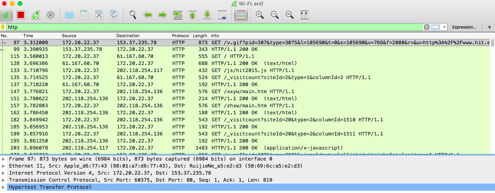
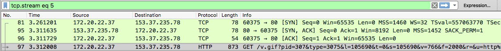
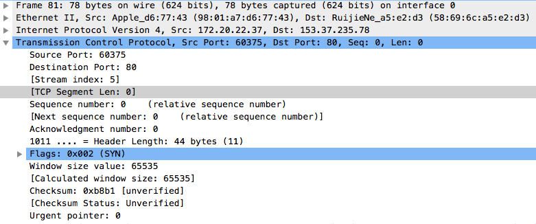
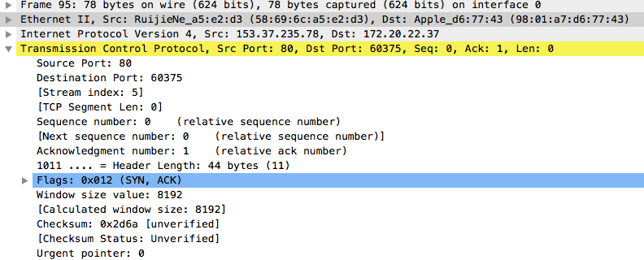
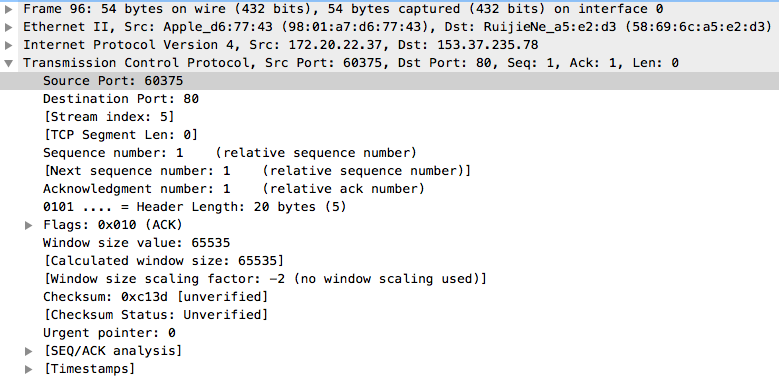
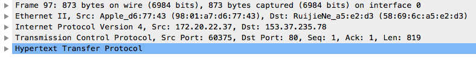
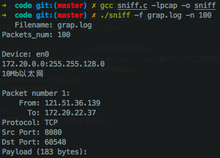
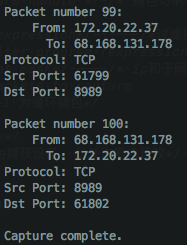
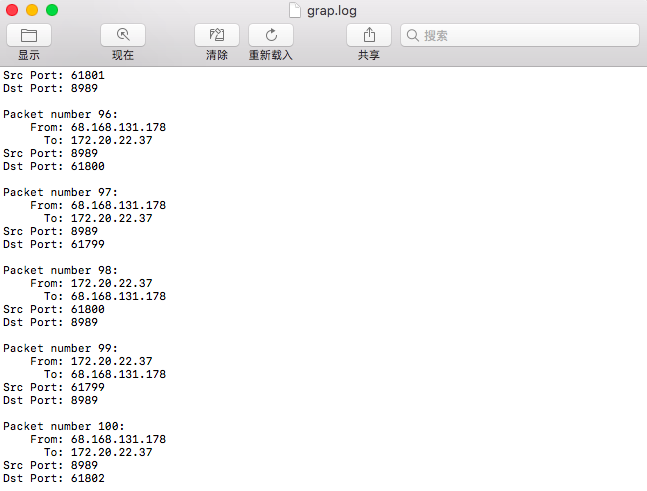

# 网络安全实验报告 - 捕包软件的使用与实现

* 实验题目：捕包软件的使用与实现
* 学号：1162100526
* 姓名：蔡晨馨


### 1. 实验目的

* 熟练使用sniff或wireshark软件。
* 深刻理解TCP三次握手的过程。
* 熟练使用libpcap或winpcap进行编程，能够完成对数据包的捕获分析。
* 深刻TCP/IP协议，并在捕包分析中熟练使用。

### 2. 实验要求及实验环境

* 实验要求：

1. 熟练使用sniffer或wireshark软件，对协议进行还原。

   能够访问网页的四元组。

2. 利用libpcap或winpcap进行编程，能够对本机的数据包进行捕获分析。

   将本机所有数据包的四元组写到指定文件。

3. 按照自己的设想撰写需求分析和详细设计。

* 实验环境：

1. Wireshark的使用：macOS High Sierra 10.13.3 | Wireshark 2.6.6

2. Libpcap捕包：macOS High Sierra 10.13.3 | C++


### 3. 实验内容

##### 1. Wireshark的使用

* 通过过滤仅查看与http协议有关的信息

* 登录[学校官网](www.hit.edu.cn)，捕获到如下信息：

  

  

* 从第一个GET报文选择Follow TCP Stream跟随，可以找到TCP三次握手的过程。

  

  接下来分析三次握手的过程：

  1. 第一次握手发送SYN。Wireshark捕获解析主要如下 (未截取可选部分和timestamp，以下相同)：

     

     * 可以很容易看到Src: 172.20.22.37即源IP，Src Port: 60375即源端口，这个实例中表示本机IP和使用的端口；Dst: 153.37.235.78即目的IP，Dst Port: 80，表示服务器IP和端口，HTTP请求一般使用80端口。

     * 该报文的Sequence Number(序列号)为0，Acknowledgment Number(确认号)为0。

       表示发送了序列号为0的数据包，并且在等待接收序列号为0的数据包。

  2. 第二次握手服务器端返回SYN，ACK，捕获信息如下：

     

     * 同理可以得到源IP: 153.37.235.78，目的IP: 172.20.22.37，源端口80，目的端口60375。

       与第一次握手正好相反。

     * 该报文的序列号为0，确认号为1。

       表示收到了客户端发送的序列号为0的数据包，正在等待序列号为1的数据包，并且发送的数据包序列号为0。

  

  

  

  

  2. 第三次握手客户端(本机)返回ACK，捕获信息如下：

     

     * 源IP: 172.20.22.37，目的IP: 153.37.235.78，源端口60375，目的端口80。

       与第一次握手正好相同。

     * 该报文的序列号为1，确认号为1。

       表示收到了服务器序列号为0的数据包，正在等待序列号为1的数据包，并且发送了序列号为1的数据包。

  三次握手完成，建立连接，开始发送数据，首先便是本机发送GET请求，捕获如下：

  

  可以看到与三次握手的TCP不同，HTTP有5层。

  这是因为HTTP位于应用层，其经过了物理层、数据链路层(以太网层)、网络层、传输层以及应用层；而TCP位于传输层，只经过了物理层、数据链路层、网络层和传输层。


##### 2. Libpcap捕包

* Libpcap 运行在类UNIX系统下的网络数据包捕获函数库，捕获网卡上的数据。

* 实验中使用到的Libpcap库函数如下：

  ```c
  /*寻找可捕获的设备*/
  char *pcap_lookupdev(char *errbuf);
  /*获取指定网络设备的网络号和掩码*/
  int pcap_lookupnet(char *device, bpf_u_int32 *netp,bpf_u_int32 *maskp, char *errbuf);
  /*打开捕获设备，promisc参数为true时进入混杂模式，最后返回会话处理程序*/
  pcap_t *pcap_open_live(char *device, int snaplen, int promisc, int to_ms, char *ebuf);
  /*用于确保捕获的设备在以太网上*/
  int pcap_datalink(pcap_t *p);
  /*将表达式编译到过滤程序中，并应用该过滤器*/
  int pcap_compile(pcap_t *p, struct bpf_program *fp, char *str, int optimize, bpf_u_int32 netmask);
  int pcap_setfilter(pcap_t *p, struct bpf_program *fp);
  /*对callback函数进行循环，
   *其中cnt告诉pcap_loop在返回之前应该嗅探多少个数据包, 负值表示循环直到发生错误
   *user为传进callback函数中的参数*/
  int pcap_loop(pcap_t * p, int cnt, pcap_handler callback, u_char * user);
  /*回调函数，函数名可以自定义
   *user对应pcap_loop中最后一个参数，是用户传入的
   *packet指向包含整个数据包的数据部分的第一个字节*/
  void callback(u_char * user, const struct pcap_pkthdr * header, const u_char * packet);
  ```

* 要对网络数据包进行捕获分析，需要定义协议的结构体，包括以太网头部、IP头部和TCP头部(或其他网络层头部)。

  * 以太网头部包括8位目标地址，8位源地址，16位以太网类型。
  * IP头部包括4位版本号，4位首部长度，8位服务类型，16位数据包总长度，16位ID，3位Flags，13位偏移字段，8位生存时间，8位协议类型，16位首部校验和，32位源IP和目的IP。
  * TCP头部包括16位源端口号，16位目的端口号，32位序号，32位确认号，4位首部长度，6位保留未用，6位标志字段，16位接受窗口，16位校验和，16位紧急数据指针。

  构造结构体之后，便可以计算其头部偏移地址，根据结构体内容直接获取需要的信息，本次实验中仅获取源IP，目的IP，源端口和目的端口。

* 本次实验参考了[TCPdump](http://www.tcpdump.org/pcap.html)官网关于pcap编程的教程。

* 主要编写了callback函数，计算IP Header位置，TCP Header位置后，获取所需信息，打印并存入文件中。

  其中文件名为pcap_loop()传入的user指针，此处调用即可。

  ```c
  FILE* fp = fopen((char*)user, "a");
  ```

* 此外还定义了命令行参数，用户可自定义一下参数：

  * -f：写入文件名，默认为sniffer.log。
  * -e：过滤表达式，默认为tcp (其他格式数据包没有进行处理，如果仅需获取源端口和目的端口，UDP与TCP结构相同)。
  * -n：捕获的数据包数量，默认值为-1，即循环捕包直到发生错误。


### 4. 实验结果

Wireshark的使用实验结果以在实验内容中有所呈现。

其中包括捕获HTTP包，根据序列号和确认号分析TCP的三次握手，以及分析HTTP数据包与TCP数据包的不同。


##### Libpcap捕包

* 编译运行代码，给定参数，日志输出文件名为grap.log，捕包数量为100。

  

* 捕获100个数据包后，程序正常退出。

  

* 查看输出日志grap.log

  
