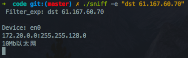

# 网络安全实验报告 - 基于libnet的程序设计

* 实验题目：基于libnet的程序设计
* 学号：1162100526
* 姓名：蔡晨馨


### 1. 实验目的

* 掌握使用libnet构造数据包的原理。
* 深刻TCP/IP协议，并在数据包构造中熟练使用。

### 2. 实验要求及实验环境

* 实验要求：

1. 掌握libnet数据包的构造原理。
2. 编程实现基于libnet的数据包构造，结合实验2给出验证过程。
3. 能够对源码进行解释。

* 实验环境：

1. libnet构造数据包：macOS High Sierra 10.13.3 | C

2. 实验2中libpcap捕包：macOS High Sierra 10.13.3 | C++


### 3. 实验内容

##### Libnet构造数据包

* 利用libnet开发应用程序需要经历一下步骤：

  * 数据包内存初始化 - libnet_init()

  * 构造数据包

    * UDP包：libnet_build_udp() - libnet_build_ipv4() - libnet_build_ethernet()
    * TCP包：libnet_build_tcp() - libnet_build_ipv4() - libnet_build_ethernet()
    * ARP包：libnet_build_arp() - libnet_build_ethernet()

    构造数据包时，需要从传输层 - 网路层 - 数据链路层向下封装，而解析的时候则是一层一层向上拆解。

  * 发送数据 - libnet_write()

  * 释放资源 - libnet_destroy()


* 以下是libnet提供的函数具体解释：

  ```c
  /*数据包内存初始化及环境建立
   *injection_type(构造的类型):LIBNET_LINK(链路层), LIBNET_RAW4(网络接口层),...*/
  libnet_t *libnet_init(int injection_type, char *device, char *err_buf);
  ```

  ```c
  /*将网络字节序转换成点分十进制数串
   *in: 网络字节序的ip地址
   *use_name: LIBNET_RESOLVE(对应主机名), 
    LIBNET_DONT_RESOLVE(对应点分十进制IPv4地址)
   *返回点分十进制ip地址*/
  char* libnet_addr2name4(u_int32_t in, u_int8_t use_name);
  u_int32_t libnet_name2addr4(libnet_t *l,  char *host_name,  u_int8_t use_name);
  ```

  ```c
  /*构造udp包
   *sp:源端口, dp:目的端口, len:udp包总长度, sum:校验和,设为0则libnet自动填充; 
   *payload:发送的文本内容, payload_s:内容长度, l:libnet_t*指针, 
   *ptag:协议标记,第一次组新的发送包时写0,同一个应用程序,下次组包时写函数返回值*/
  libnet_ptag_t libnet_build_udp(u_int16_t sp, u_int16_t dp,
                                 u_int16_t len, u_int16_t sum,
                                 u_int8_t *payload, u_int32_t payload_s,
                                 libnet_t *l, libnet_ptag_t ptag);
  /*构造tcp包
   *sp:源端口, dp:目的端口, seq:序号, ack:ack标记, control:控制标记, win:窗口大小,
   *sum:校验和,设为0则libnet自动填充; urg:紧急指针, len:tcp包总长度,
   *payload:发送的文本内容, payload_s:内容长度, l:libnet_t*指针, 
   *ptag:协议标记,第一次组新的发送包时写0,同一个应用程序,下次组包时写函数返回值*/
  libnet_ptag_t libnet_build_tcp(u_int16_t sp, u_int16_t dp,
                                 u_int32_t seq, u_int32_t ack,
                                 u_int8_t control, u_int16_t win
                                 u_int16_t sum, u_int16_t urg,
                                 u_int16_t len, u_int8_t *payload,
                                 u_int32_t payload_s, libnet_t *l,libnet_ptag_t ptag );
  /*构造IPv4数据包
   *ip_len:ip包总长, tos:服务类型, id:ip标识, flag:片偏移, ttl:生存时间, 
   *prot:上层协议, sum:校验和, src:源ip, dst:目的ip, 
   *payload:内容, payload_s:内容长度, l:libnet句柄, ptag:协议标记*/
  libnet_ptag_t libnet_build_ipv4(u_int16_t ip_len, u_int8_t tos,u_int16_t id, 
                                  u_int16_t flag,u_int8_t ttl, u_int8_t prot,
                                  u_int16 sum, u_int32_t src,u_int32_t dst, 
                                  u_int8_t *payload,u_int32_t payload_s,libnet_t *l,
                                  libnet_ptag_t ptag );
  ```

  ```c
  /*构造arp数据包
   *hrd:硬件地址格式,ARPHRD_ETHER(以太网), pro:协议地址格式,ETHERTYPE_IP(IP协议)
   *hln:硬件地址长度, pln:协议地址长度,
   *op:ARP协议操作类型(1.ARP请求,2.ARP回应,3.RARP请求,4.RARP回应)
   *sha:发送者硬件地址, spa:发送者协议地址, tha:目标硬件地址, tpa:目标协议地址,
   *payload, payload_s, l, ptag*/
  libnet_ptag_t libnet_build_arp(u_int16_t hrd, u_int16_t pro, u_int8_t hln, u_int8_t pln,
                                 u_int16_t op, u_int8_t *sha,u_int8_t *spa, u_int8_t *tha,
                                 u_int8_t *tpa, u_int8_t *payload, 
                                 u_int32_t payload_s, libnet_t *l, libnet_ptag_t ptag );
  /*构造以太网数据包
   *dst:目的mac, src:源mac, type:上层协议类型, payload, payload_s, l, ptag*/
  libnet_ptag_t libnet_build_ethernet(u_int8_t*dst, u_int8_t *src,
                                      u_int16_ttype, u_int8_t*payload,
                                      u_int32_tpayload_s, libnet_t*l,libnet_ptag_t ptag );
  ```

  ```c
  /*发送数据包*/
  int libnet_write(libnet_t * l);
  /*释放资源*/
  void libnet_destroy(libnet_t *l);
  ```

### 4. 实验结果

##### Libnet构造数据包 + Libpcap捕包

* 构造的数据包内容如下：

  ```c
  u_char src_mac[6] = {0x98, 0x01, 0xa7, 0xd6, 0x77, 0x43};		/*源mac*/
  u_char dst_mac[6] = {0x58, 0x69, 0x6c, 0xa5, 0xe2, 0xd3};		/*目的mac*/
  char* src_ip_str = "172.20.26.208";													/*源ip*/
  char* dst_ip_str = "61.167.60.70";													/*目的ip*/
  int src_port = 51938;																				/*源端口*/
  int dst_port = 80;																					/*目的端口*/
  payload_s = sprintf(payload, "%s", "Can you hear me?");			/*发送内容*/
  ```

* 运行实验2的sniffer，将过滤表达式设为`"dst 61.167.60.70"`，使用目的ip作为过滤标准。

  

  

* 编译运行本实验程序，发送具有上述特性及内容的tcp包

  

* 这时，sniffer可以捕获到这个数据包，打印出四元组及其内容`Can you hear me?`

  

* 发送具有相同内容的udp包

  

* sniffer也能捕获到(由于实验2中没有写获取udp包端口和内容的代码，故此处不予以显示)

  

* 倘若使用Wireshark捕获，可以得到以下结果：

  

  使用过滤，`ip.addr == 61.167.60.70`，UDP和TCP包均被捕获。


* 查看其内容，可以真实还原。

  


